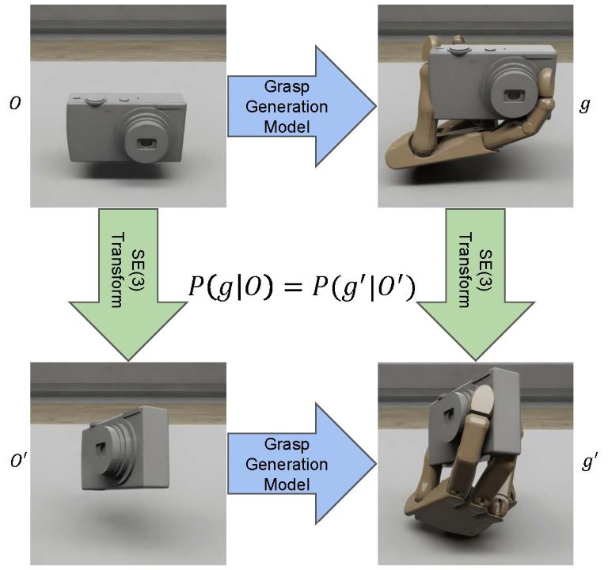

<!-- Using HTML to center the abstract -->

    

        <h2>Abstract</h2>
        

    We propose a novel framework for dexterous grasp generation that leverages geometric algebra representations to enforce equivariance to SE(3) transformations. By encoding the SE(3) symmetry constraint directly into the architecture, our method improves data and parameter efficiency, while enabling robust grasp generation across diverse object poses. Additionally, we incorporate a differentiable physics-informed refinement layer, which ensures generated grasps are physically plausible and stable. Extensive experiments demonstrate the model's superior performance in generalization, stability, and adaptability compared to existing methods.
        

    

